<div align="center">

<a href="https://postrun.app">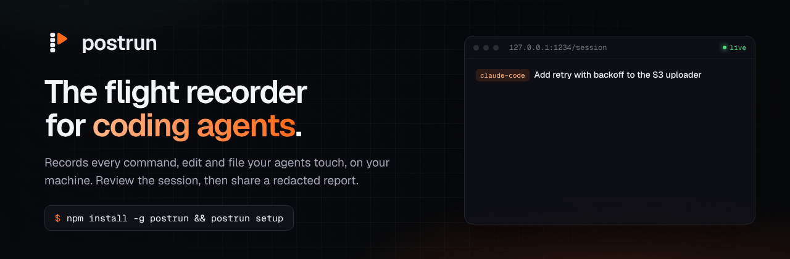</a>

<br>

[](https://www.npmjs.com/package/postrun)
[](LICENSE)
[](https://nodejs.org)
[](https://docs.postrun.app)
[](https://docs.postrun.app/security/)

**[Website](https://postrun.app)** · **[Live demo](https://postrun.app/demo/)** · **[Docs](https://docs.postrun.app)** · **[Example report](https://postrun.app/example-report.html)** · **[Changelog](https://postrun.app/changelog/)**

</div>

---

Your coding agent just spent forty minutes in your repo. What did it actually run? Which files did it touch? Did it print a secret, force push, or quietly skip a failing test?

**Postrun records every command, edit, file read and reply your agents make, on your own computer.** You review the whole session in a local app, sign it off, and when someone else needs to see it, you send a redacted report as a file or a link that expires.

- **Nothing leaves your machine** unless you export or share a session.
- **No account needed** to record or review. An account is only for share links.
- **Free and open source** under the MIT license.

<div align="center">
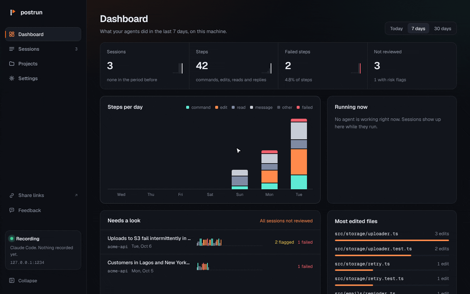
<br><sub>The review app on 127.0.0.1:1234: dashboard, sessions, a failed step, every change as a diff, then a share link in two clicks.</sub>
</div>

## Quick start

```bash
npm install -g postrun
postrun setup
```

`setup` connects Claude Code, finds Cline, starts recording in the background and opens the review app. Restart any agent session that was already open, and it's recorded from then on. Requires Node 22.13 or later on macOS or Linux.

<div align="center">
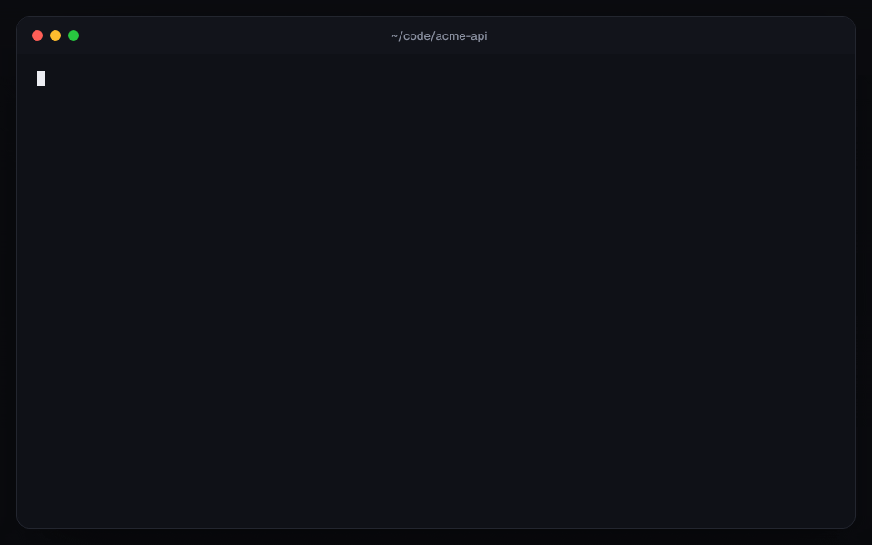
<br><sub>Real output from <code>postrun setup</code>, <code>postrun sessions</code> and <code>postrun share</code>.</sub>
</div>

## Contents

- [What you get](#what-you-get)
- [How it fits together](#how-it-fits-together)
- [Share a session](#share-a-session)
- [Privacy and security](#privacy-and-security)
- [The command line](#the-command-line)
- [What's been built](#whats-been-built)
- [Working on Postrun](#working-on-postrun)
- [Contributing, security reports and license](#contributing-security-reports-and-license)

## What you get

<table>
<tr>
<td width="50%" valign="top">

### A dashboard of what your agents did
Sessions, steps, failures and what you haven't reviewed yet, steps per day by kind, what's running now, and the files your agents edit most.

</td>
<td width="50%" valign="top">

### Every session, at a glance
Each session has a **strip**: its steps in order, coloured by kind, with failures in red. Search inside sessions, filter by agent, date, size, failures, risk flags or review status.

</td>
</tr>
<tr>
<td>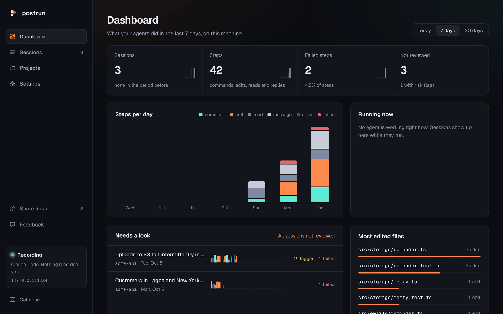</td>
<td>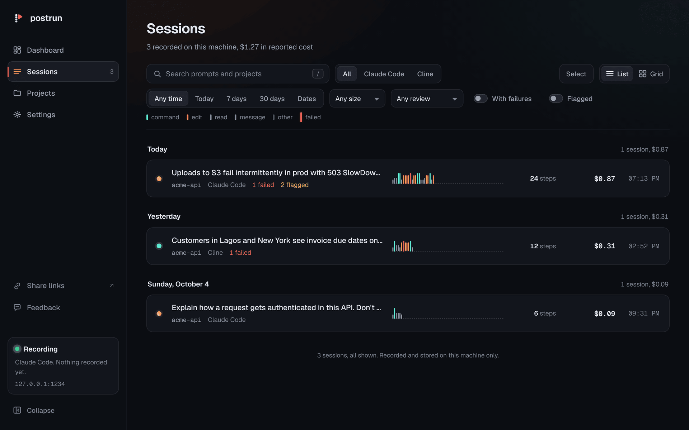</td>
</tr>
<tr>
<td width="50%" valign="top">

### Review it, then sign it off
A plain summary of what happened, cost, tokens and turns, **risk flags** (`rm -rf`, force pushes, `curl | sh`, secrets printed or committed, edits outside the project), and your verdict: *Looks good* or *Needs follow-up*, with a note.

</td>
<td width="50%" valign="top">

### Open any step
The command with its full output and exit code, the edit as a diff, the prompt or reply, the error. Keyboard friendly: `j`/`k` through steps, `f` to the next failure, `a`/`n` to review.

</td>
</tr>
<tr>
<td>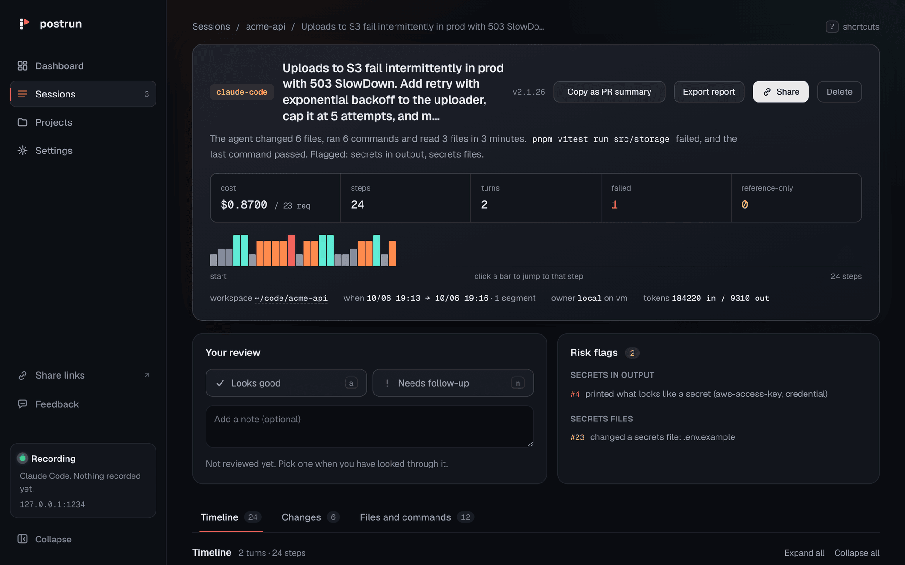</td>
<td>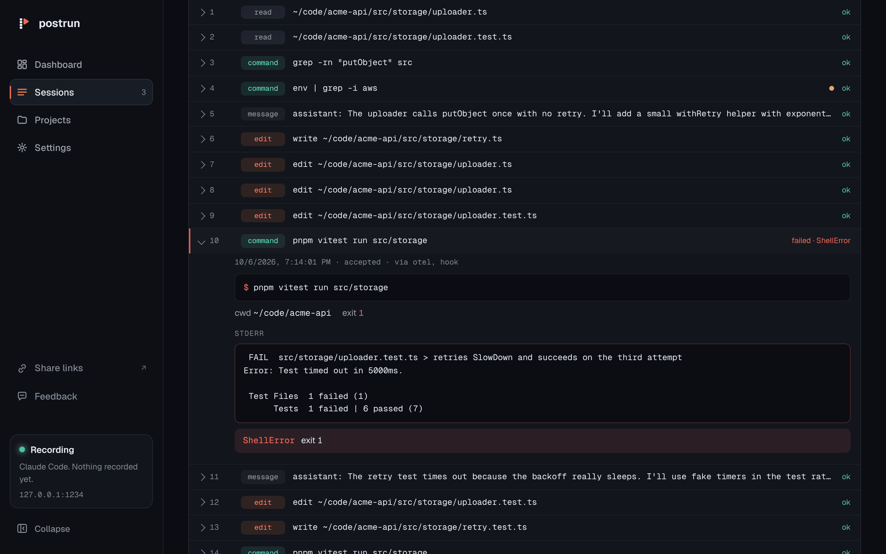</td>
</tr>
<tr>
<td width="50%" valign="top">

### Every change, file by file
The **Changes** tab shows each edit as a diff with lines added and removed. **Copy as PR summary** turns the session into Markdown for a pull request description.

</td>
<td width="50%" valign="top">

### Redacted before it goes anywhere
Exports and share links mask private keys, cloud and API keys, tokens, passwords, cookies, credential-named values and email addresses, and turn home paths into `~`. You see every masked value **before** anything is written or sent.

</td>
</tr>
<tr>
<td>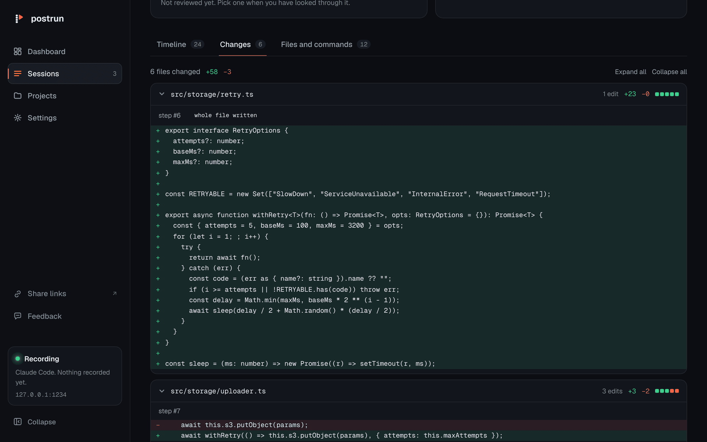</td>
<td>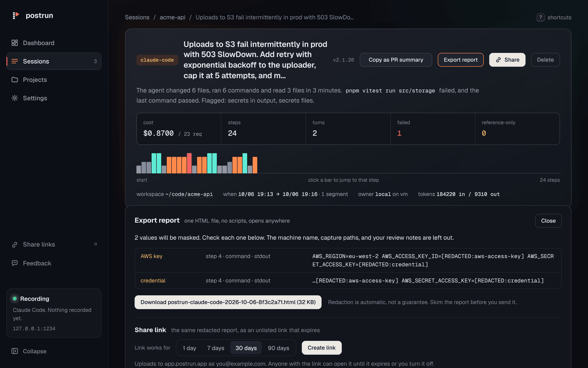</td>
</tr>
</table>

Also in the review app: **Projects** (each folder your agents worked in, with failure rates and most changed files), the git branch and commits on every session, a light theme, pause recording, storage and backups, start at login, delete one session or everything, and local-only usage counts.

## How it fits together

Postrun is one tool on your computer, plus an account only if you share.

| Where | What it's for | Account? |
|---|---|---|
| **`postrun`** command | Installs, starts and checks the recorder. `sessions`, `export`, `share`, `doctor` | No |
| **Review app**, `http://127.0.0.1:1234` | Reading and reviewing sessions, exporting, the **Share** button, feedback | No |
| **[app.postrun.app](https://app.postrun.app)** | Your share links, how often each was opened, turning them off, connected computers | Free account |
| **[docs.postrun.app](https://docs.postrun.app)** | Quickstart, every command, how redaction works, troubleshooting | No |

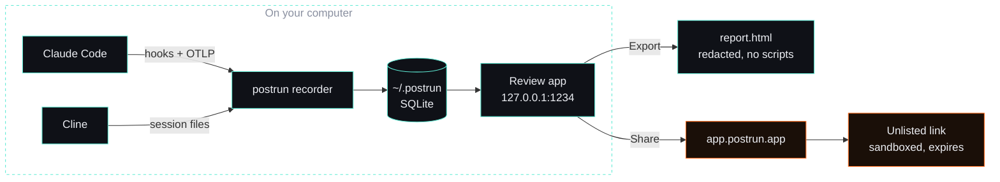

<table>
<tr>
<td width="50%">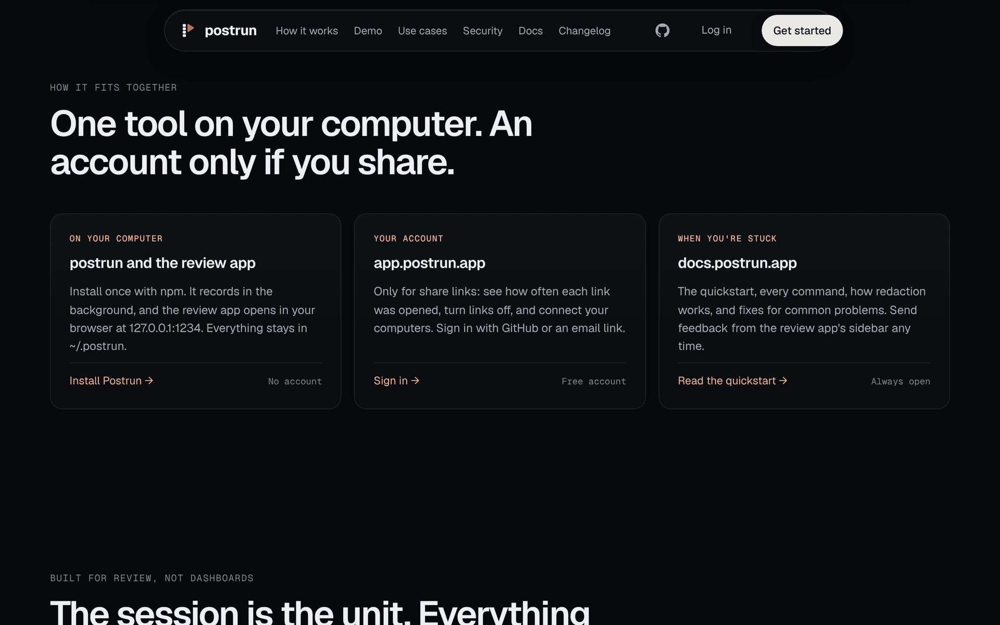</td>
<td width="50%">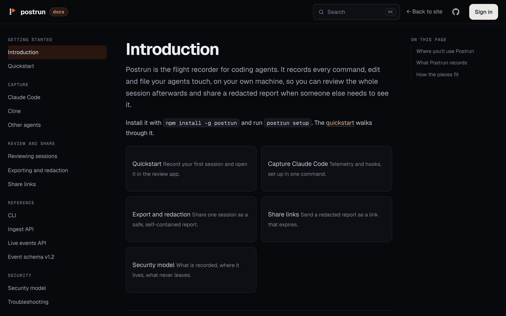</td>
</tr>
<tr>
<td align="center"><sub><a href="https://postrun.app">postrun.app</a> explains what runs where</sub></td>
<td align="center"><sub><a href="https://docs.postrun.app">docs.postrun.app</a>: quickstart, CLI, redaction, security</sub></td>
</tr>
</table>

## Share a session

Sometimes a teammate, a reviewer or a client needs to see what the agent did. Click **Share** on any session. The first time, **Connect account** links this computer to a free account in your browser, with no terminal and no token to copy. Pick how long the link lasts (1, 7, 30 or 90 days), create it, and send it.

<div align="center">

</div>

<br>

<table>
<tr>
<td width="50%" valign="top">

<b>Your links, at app.postrun.app</b><br>
Every link with how often it was opened, when it expires, and **Turn off**, which deletes the report from Postrun's servers at once.

</td>
<td width="50%" valign="top">

<b>What they see</b><br>
The same redacted report as an export, read-only, in a sandbox with no scripts, forms or network access. Never cached or indexed.

</td>
</tr>
<tr>
<td>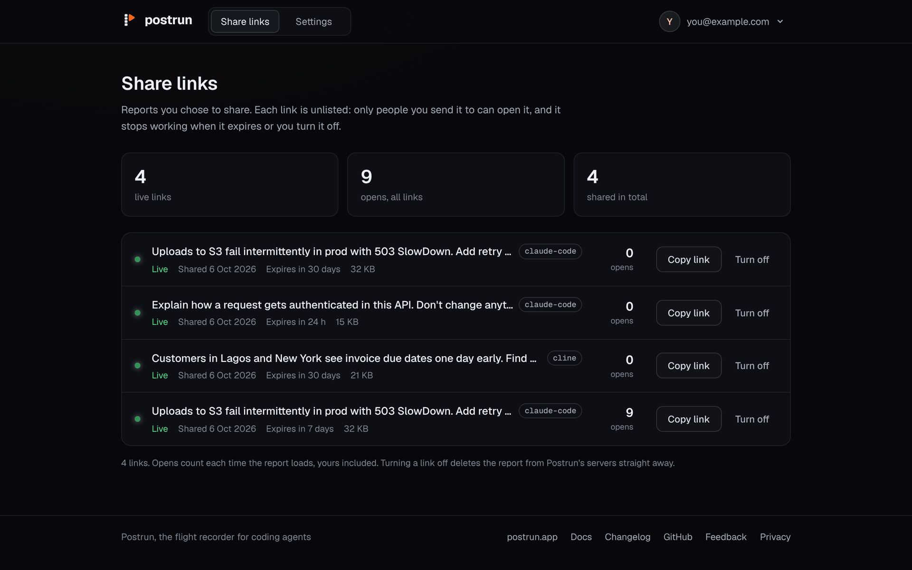</td>
<td>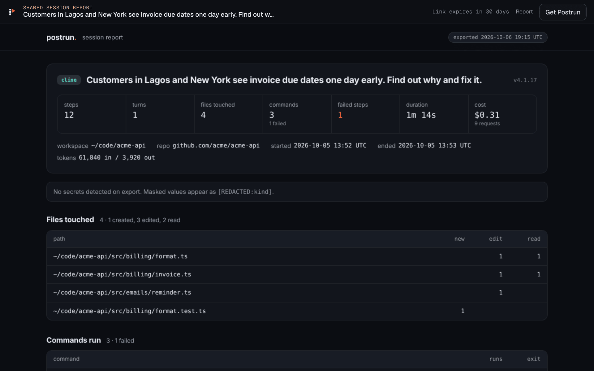</td>
</tr>
<tr>
<td width="50%" valign="top">

<b>Sign in with GitHub or an email link</b><br>
No passwords. Either way creates your account the first time.

</td>
<td width="50%" valign="top">

<b>A first visit that explains itself</b><br>
A new account gets a three-step checklist that ticks itself off: install, connect a computer, share a session.

</td>
</tr>
<tr>
<td>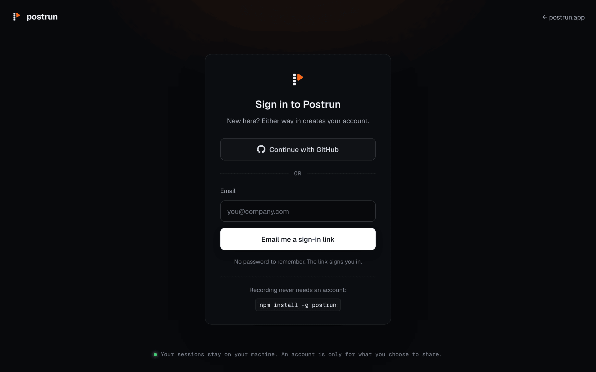</td>
<td>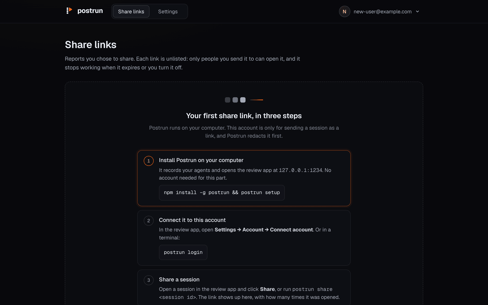</td>
</tr>
</table>

Prefer the terminal? `postrun login` once, then `postrun share <session id>`. On a machine without a browser, make a token in Settings and run `postrun login --with-token`.

## Privacy and security

Postrun records full prompts, replies, commands and their output, so it is built to keep that on your machine.

**On your computer**

- The recorder and the review app listen on `127.0.0.1` only, refuse any `Host` that isn't a loopback name (which blocks DNS rebinding), and send no CORS headers. Other sites can't frame the review app.
- The review app opens only in a browser you connected with `postrun open`, so other accounts on a shared computer can't read your sessions.
- Everything under `~/.postrun` is owner-only (folders `0700`, files `0600`). Deleted sessions are overwritten, not just unlinked.
- Postrun reads agent files but never writes them. The one exception is `~/.claude/settings.json`, which is backed up once and merged in place. `postrun uninstall` puts it back.
- No native dependencies: storage uses the SQLite built into Node.

**When you share**

- Only the redacted HTML report is uploaded, and only when you ask. Nothing else about your sessions, and no background sync.
- Shared reports are served with `sandbox; default-src 'none'` in a sandboxed frame, so a report can't run code, submit forms or load anything. Only genuine Postrun reports are accepted.
- `postrun login` uses a one-off listener on `127.0.0.1` plus PKCE: the browser only ever carries a one-time code that expires in two minutes, and the computer swaps it for a token by proving it started the login. Tokens and sign-in links are stored only as SHA-256 hashes.
- Sign-in emails, uploads, bad tokens and feedback are rate limited per address and per IP. Links you turn off are deleted immediately, and expired reports are swept.

<details>
<summary><b>How connecting a computer works</b></summary>

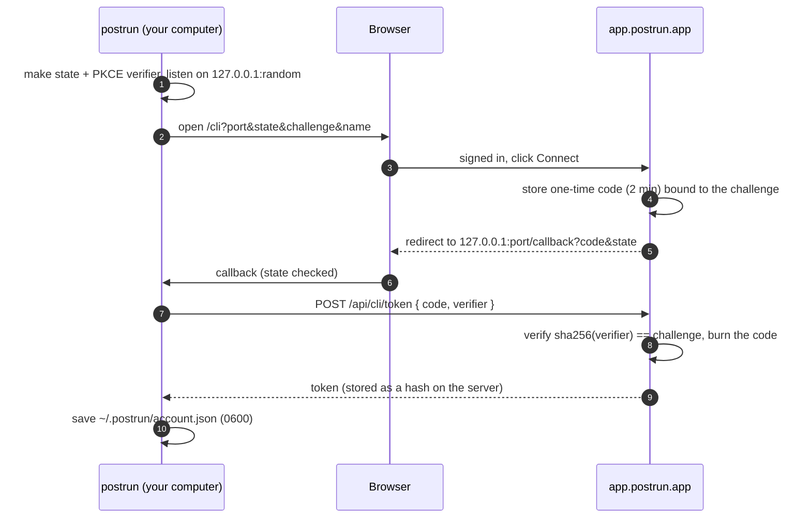

</details>

Redaction is automatic, not a guarantee, so skim a report before you send it. Found a problem? See [SECURITY.md](SECURITY.md).

## The command line

| Command | What it does |
|---|---|
| `postrun setup` | Set up Claude Code, find Cline, start recording, open the review app |
| `postrun status` | Is it recording, where the review app is, and whether this computer is connected for share links |
| `postrun open` | Open the review app |
| `postrun sessions` | List recorded sessions |
| `postrun export <id>` | Write a redacted HTML report and list every masked value |
| `postrun share <id> [--expires 1\|7\|30\|90]` | Upload a redacted report and print a link |
| `postrun login` / `logout` | Connect or disconnect this computer for share links |
| `postrun stats` | How you use Postrun: counts only, to read or paste |
| `postrun feedback` | Rate Postrun and say what's missing (you see it before it's sent) |
| `postrun delete <id>` | Delete one session for good |
| `postrun start` / `stop` / `restart` | Control the background process |
| `postrun autostart on\|off` | Start Postrun when you log in |
| `postrun doctor` | Check everything, with a fix for each problem |
| `postrun uninstall` | Take Postrun out of Claude Code and stop it |

Full reference: [docs.postrun.app/reference/cli](https://docs.postrun.app/reference/cli/).

## What's been built

Postrun went from a schema and a pressure test to a recorder, a review app, a website, docs and a hosted share service. The highlights, newest first:

| Release | What shipped |
|---|---|
| **0.3.1** Clearer paths | A **Share** button on every session, with **Connect account** right there the first time. `postrun status` shows the account, `postrun setup` ends with how to share. A self-ticking first-visit checklist at app.postrun.app. postrun.app explains what runs where. |
| **0.3.0** Feedback, one connected Postrun | Rating and feedback from the review app, the terminal and app.postrun.app, always shown before it's sent. Connect your account from Settings in one click. Open source under MIT. |
| **0.2.0** Share links and accounts | app.postrun.app with GitHub or email-link sign-in, unlisted links that expire, open counts, turn off, connected computers, `postrun login` and `postrun share`. Sandboxed report viewer. |
| Usage, on your machine | Settings > Your usage and `postrun stats`: counts only, never content, never sent. |
| A security pass | A full audit and fixes: far wider redaction, loopback-only review app tied to your browser, telemetry accepted only from Claude Code, safer stop, setup and uninstall, smarter risk flags. |
| Review, not just replay | Dashboard, projects, review verdicts and notes, the Changes tab, risk flags, full-text search, git branch and commits, PR summaries, keyboard review, settings, bulk export. |
| A review app that moves | The step strip and tape, filters, list and grid views, live updates, loading that keeps up with thousands of sessions. |
| **0.1** One command to install | `npm install -g postrun && postrun setup`, `doctor`, `uninstall`, one quiet background process, start at login. |
| Light on a long day | Several agents in parallel for twelve hours costs about 1% of one CPU core. Logs read in small pieces, raw captures cleaned up after a day. |
| Every step, opened up | Full detail per step, and Claude Code sessions rebuilt from hook logs when the recorder wasn't running. |
| Export and live view | Self-contained HTML reports with redaction, live session updates, and an ingest API with a v1.2 schema for your own adapters. |

The full history is at [postrun.app/changelog](https://postrun.app/changelog/).

**Next:** Cursor and Codex adapters, an ideas board with upvotes, and "Was this useful?" on shared reports.

## Working on Postrun

A pnpm monorepo:

```
core/            @postrun/core   the recorder, store, redaction, export, local server and the postrun CLI
apps/ui/         @postrun/ui     the review app (Next.js static export, bundled into the npm package)
apps/app/        @postrun/app    app.postrun.app: accounts and share links (Next.js on Vercel, Postgres on Neon)
apps/web/        @postrun/web    postrun.app, the website and live demo (static export)
apps/docs/       @postrun/docs   docs.postrun.app
packages/brand/                  logo, loader, tokens and fonts shared by every app
packages/postrun/                the npm package
docs/                            schema drafts, pressure test and decisions
```

```bash
pnpm install
pnpm test          # every package
pnpm typecheck
pnpm dev:core      # the local server on 127.0.0.1:1234
pnpm dev:ui        # the review app with hot reload, /api proxied to dev:core
pnpm dev:web       # postrun.app on 127.0.0.1:3100
```

<details>
<summary><b>More commands</b></summary>

```bash
pnpm ingest --agent claude-code ~/.postrun/captures   # normalise and store a Claude Code capture
pnpm ingest --agent cline <session-id>                # store a Cline session (~/.cline/data/sessions)
pnpm sessions                    # list stored sessions (--agent <kind> to filter)
pnpm export <session-id>         # one redacted, self-contained HTML report (-o <file>)
pnpm serve                       # build the review app, then serve the store on 127.0.0.1:1234
pnpm adapter:cc ~/.postrun/captures > steps.json   # Claude Code captures as Step[] JSON (no store)
pnpm adapter:cline <session-id> > steps.json       # a Cline session as Step[] JSON (no store)
pnpm demo:build                  # rebuild the public demo and example report for postrun.app
pnpm build:package               # build the npm package
pnpm test:install                # install the packed package into a clean folder and run it
pnpm release patch               # bump, test, tag and publish (or: minor, x.y.z, --dry)
```

Sessions live in `~/.postrun/postrun.db` (override with `POSTRUN_HOME`, `POSTRUN_DB` or `--db`). The server reads the store and never runs adapters. Your own adapters can push v1.2 batches to `POST /api/ingest` with the bearer token in `~/.postrun/ingest-token`; see [`core/src/server/README.md`](core/src/server/README.md).

`apps/app` needs Postgres and the settings in [`apps/app/.env.example`](apps/app/.env.example); see [`apps/app/README.md`](apps/app/README.md). Secrets never go in this repository: every `.env` file is ignored.

</details>

## Contributing, security reports and license

- Ideas and bugs: [open an issue](https://github.com/herocodess/postrun/issues), or send feedback from the review app's sidebar. See [CONTRIBUTING.md](CONTRIBUTING.md).
- Vulnerabilities: email **hm@heromomoh.com**, not a public issue. See [SECURITY.md](SECURITY.md).
- [MIT](LICENSE) © 2026 Hero Momoh.

<div align="center">
<br>
<a href="https://postrun.app"><picture><source media="(prefers-color-scheme: dark)" srcset="apps/web/public/logo-mark.svg"></picture></a>
<br>
<sub>Built for people who let agents write code and still want to know what happened.</sub>
</div>
